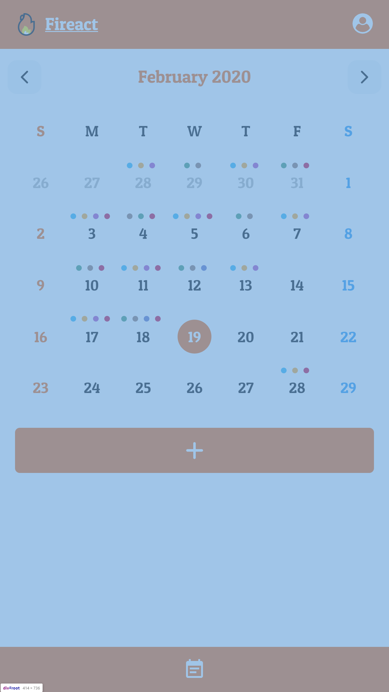
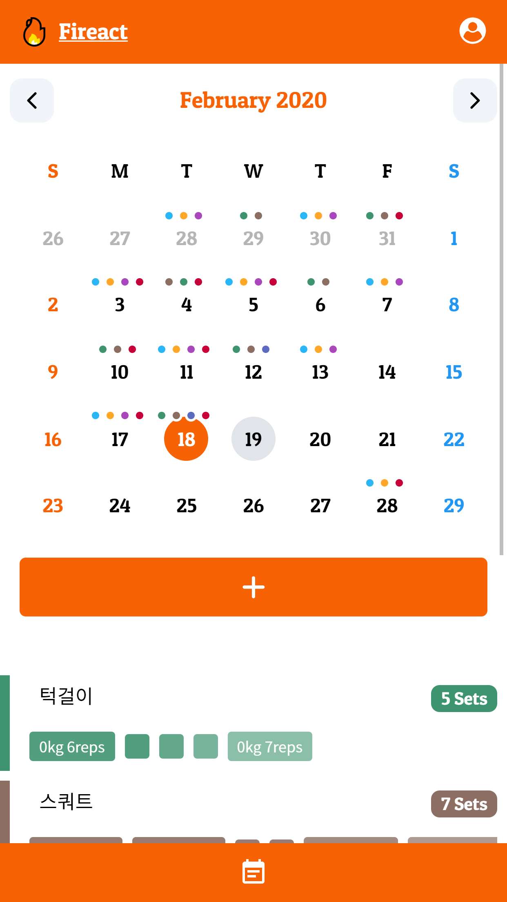

# 🔥 Fireact

## 소개
운동 세트를 기록하기 위한 웹앱.

## 현재 상태

- 새로운 UX/UI와 기능을 기획 중.
- `Firebase`를 떠나 `AWS`의 서비스들을 이용하여 개발할 예정. (`AWS Amplify` 등)
- `GraphQL` 도입할 예정.
- `CSR`을 버리고 `SSR` 방식으로 서비스할 예정 (`Next.js`)

## 기술 스택

- React.js
- Typescript
- Redux
- Redux-saga
- immer
- Firebase
- Firebase Authentication
- Firestore

## 성과

- `Firebase Authentication`을 이용한 소셜 로그인 (`Google`, `Facebook`) 개발
- 날짜별 운동 기록, 수정, 삭제 기능 개발 (`Firestore`에 저장) 
- 다른 라이브러리 사용 없이, `moment.js` 만으로 Calander Component 개발
- `LocalStorage`를 이용하여 로그인 유지 기능 개발

## 소회

- 처음으로 혼자 진행한 사이드 프로젝트라서 애착이 많이 가는 프로젝트입니다.
- 4번이나 새로 뜯어고친 프로젝트임에도 완성도가 떨어져서 많이 아쉽게 생각합니다. (5번째 리뉴얼 계획중)
- 현재도 운동할 때, 사용하고 있습니다. 
- `Mobile`에서만 현재 `UI`가 정상적으로 나옵니다.

## Screenshots

</img>
</img>
</img>
